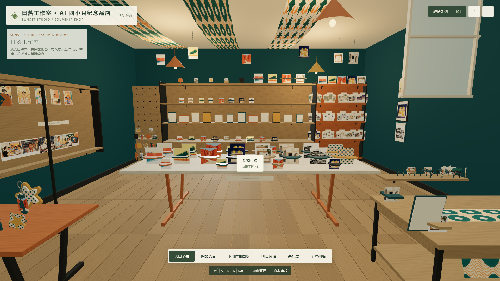

# Photo Souvenir Shop · 照片纪念品店

**English** · [简体中文](README.zh-CN.md)

> Turn your personal photographs into an explorable **3D souvenir shop** — walk around, look up at hanging ornaments, pick up gifts, rotate them in your hand, and compare them with the photos that inspired them.
>
> 把个人照片变成一间可以漫步的 3D 纪念品店：推门进去、抬头看挂饰、拿起商品把玩、和启发它的照片对照。

---

## 🎬 Online preview · 在线预览

**Sunset Studio · AI 四小只纪念品店**（示例店，由真实账号素材设计而成）：

### 🌐 https://zhaosenlin12-creator.github.io/create-photo-shop/

> 在线预览就是「落日工作室」本地效果：墨绿墙、暖木家具、柑橘暖光，照片架、小创作者画廊（双层十幅人物插画）、陶器长台、明信片墙、布艺展示台与 8 款浮雕冰箱贴。WASD 移动、拖动环顾、点击拿起把玩、滚轮缩放。

| 入口全景 | 小创作者画廊 | 回忆照片架 |
| --- | --- | --- |
|  |  | 更多截图见仓库 `screenshots/` |

---

## What this project is · 这是什么

一个**自包含的 Skill + 完整示例工程**，让任何人（或任何支持 Codex Skills 的 AI 助手）用一组照片生成一间有真实空间感、丰富商品与可交互体验的 3D 纪念品店网站：

- 无需后端、无需 API Key、无需 JavaScript 构建步骤——产物是纯静态网页（vanilla JavaScript + Three.js）。
- 一个可漫步的房间：入口视觉重心、明信片墙、照片架、画廊、陶器长台、布艺展示台、挂帘与吊灯，均由 AI 依据五张真实礼品店参考照片重新构图。
- 十一类必备商品：钥匙扣、冰箱贴、徽章、明信片、盘子、小碟、墙画、桌布、小笔记本、笔、杯垫——形状与画面全部来自你的照片。
- 质量工作流：照片审阅 → 风格化插画生成 → 商品建模 → 构建 → 几何校验 → 渲染审查 → 审计。

### Demo shop · 示例店「Sunset Studio 日落工作室」

`sunset-studio/` 是本仓库自带的完整示例：用「AI 四小只」账号的 15 张照片素材，设计出：

- **33 幅插画作品**（水粉 / 纸拼贴 / 木刻 / 织纹四种媒介，全部由源照片改编）
- **101 款商品**（47 款自定义 3D 建模，含 8 款浮雕磁贴、8 款陶瓷盘、8 款小碟……）
- **236 个陈列对象**，照片衍生率 100%
- 6 个导览机位：入口全景 / 陶器长台 / 小创作者画廊 / 明信片墙 / 悬挂层 / 主陈列墙

素材见 `img/`（示例用途，来源为账号公开内容改编插画，非真人照片）。

---

## Quick start for other users · 其他用户如何上手

### 1. 拉取项目

```bash
git clone https://github.com/zhaosenlin12-creator/create-photo-shop.git
cd create-photo-shop
```

### 2. 用你自己的照片做一间纪念品店

把照片放进任意目录（例如 `my-photos/`），然后让支持 Codex Skills 的 AI 助手使用本项目内置的 Skill：

```text
Use $create-photo-souvenir-shop with the photos in my-photos.
Review every photo and create a personal 3D souvenir shop with stylized
postcards, keychains, magnets, badges, plates, small dishes, wall art,
a tablecloth, a notebook, a pen and coasters.
```

Skill 位于 [`skills/create-photo-souvenir-shop/`](skills/create-photo-souvenir-shop/)，包含：

| 文件 | 作用 |
| --- | --- |
| `SKILL.md` | 工作流总纲（照片审阅 → 设计 → 构建 → 审查） |
| `references/shop-design.md` | 空间 / 陈列 / 光环境设计准则（含 5 张真实礼品店参考图） |
| `references/art-direction.md` | 商品造型与最终多样性检查 |
| `references/collection-schema.md` | 清单 schema（photos / artworks / gifts / scene） |
| `references/runtime.md` | 自定义几何钩子与运行时说明 |
| `references/quality-workflow.md` | 质量工作流：先做小样、再铺全量 |
| `scripts/*` | prepare / build / validate / render / audit 脚本 |

### 3. 手动构建（也完全可以不用 AI，自己编辑清单）

```bash
# 安装渲染审查依赖（可选，用于出审查图）
cd tooling && npm install && cd ..

# 用示例清单构建一间店
python skills/create-photo-souvenir-shop/scripts/build_shop.py \
  sunset-studio/source/collection.json my-shop

# CPU 几何校验（无需浏览器）
node skills/create-photo-souvenir-shop/scripts/validate_shop.mjs my-shop

# 渲染审查图（需要 Playwright + Chromium）
SHOP_PLAYWRIGHT_MODULE=/abs/path/to/playwright/index.mjs \
SHOP_CHROME=/abs/path/to/chrome \
node skills/create-photo-souvenir-shop/scripts/render_review.mjs my-shop my-review

# 清单审计
python skills/create-photo-souvenir-shop/scripts/audit_collection.py my-shop \
  --review my-review --final

# 本地预览
python -m http.server 4173 --bind 127.0.0.1 --directory my-shop
# 浏览器打开 http://127.0.0.1:4173/
```

### 4. 编辑示例清单，改成你自己的店

可编辑源都在 [`sunset-studio/source/`](sunset-studio/source/)：

```text
sunset-studio/source/
├── collection.json     # 照片 / 插画 / 商品 / 房间 / 视图 的总清单
├── custom-shop.js      # 自定义商品建模（盘 / 碟 / 桌布 / 笔 / 杯垫 / 磁贴……）
├── photos/             # 虚构旅行照片（p1-p6）
└── art/                # 33 幅插画（a/m/n/o 系列）
```

改 `collection.json` 里的 `photos`（换成你的照片路径）、`artworks`（换成你的插画）、`gifts` 与 `scene`（房间 / 陈列 / 机位），然后重新 build 即可。

---

## Repository layout · 目录结构

```text
.
├── skills/create-photo-souvenir-shop/   # Skill 本体（SKILL.md + references + scripts）
├── sunset-studio/                       # 完整示例店（可编辑源 + 构建产物）
│   ├── source/                          # collection.json / custom-shop.js / 图片资产
│   └── build/                           # 已构建的静态站点（在线预览即此目录）
├── img/                                 # 示例素材（AI 四小只 15 张）
├── screenshots/                         # README 用截图
└── tooling/                             # 渲染审查依赖（npm install 后使用）
```

> `sunset-studio/review/`（渲染审查证据）与 `tooling/node_modules/` 不入库；按上文命令可随时重新生成。

---

## Skill install · Skill 安装方式

```bash
python3 ~/.codex/skills/.system/skill-installer/scripts/install-skill-from-github.py \
  --repo zhaosenlin12-creator/create-photo-shop \
  --path skills/create-photo-souvenir-shop \
  --ref main
```

或直接把 [`skills/create-photo-souvenir-shop/`](skills/create-photo-souvenir-shop/) 复制进你的 skill 目录。

---

## License

MIT（Skill 与脚本）；示例店的插画与素材仅作演示用途，来源于「AI 四小只」账号公开内容改编，不随项目另行授权。
